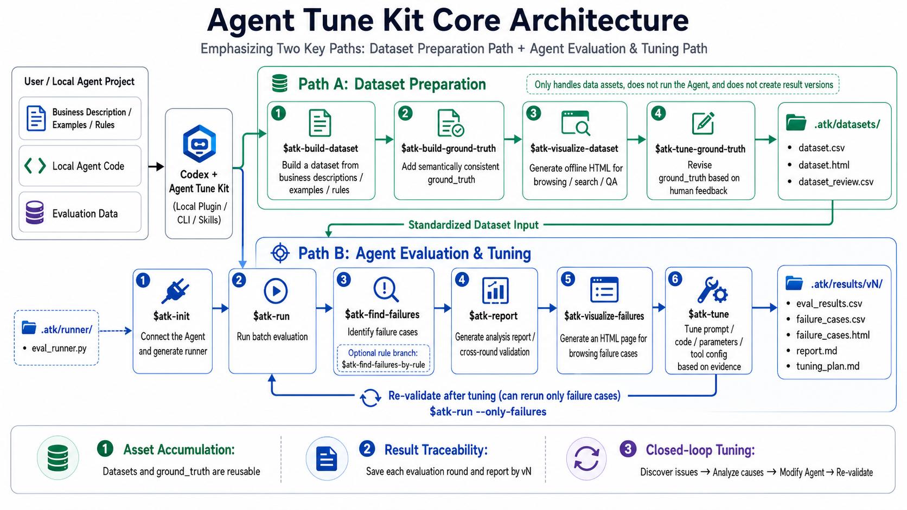

# Agent Tune Kit

English | [简体中文](README.md)

[](https://pypi.org/project/agent-tune-kit/)

Agent Tune Kit is a **local Codex plugin** for moving your local Agent from "it runs" to "it can be evaluated, diagnosed, and iteratively tuned."

It focuses on two jobs: first turn evaluation data into a reusable, human-reviewable asset; then connect Agent batch evaluation, failure discovery, reporting, failure review, and Codex-driven tuning into a repeatable loop.

## Architecture



## Who It Is For

Use it if you already have, or are ready to organize:

- A local Agent, chatbot, tool-using Agent, or RAG Agent.
- A small evaluation dataset, preferably CSV; 5 to 20 rows are enough to start.
- Inputs, expected answers, or human-checkable results.
- A desire to let Codex help locate weak spots and tune prompts, code, parameters, or tool configuration.

## Project Value

Agent Tune Kit is not just a way to run one test. It separates Agent tuning into two clear paths:

- **Dataset Preparation**: generate a dataset from business context, examples, or rules; enrich `ground_truth`; review the dataset in local HTML; and correct expected results from human feedback. The dataset is stored under `.atk/datasets/` and is not tied to a single evaluation run.
- **Agent Evaluation and Tuning**: connect an existing Agent to a runner, run batch evaluation, find failure cases, generate an analysis report, review failures in local HTML, and let Codex tune the Agent from evidence. Each run writes to `.atk/results/vN/` so you can validate whether later versions actually improve.

This turns Agent tuning from one-off subjective trial and error into an engineering workflow with samples, results, reports, and tuning records.

## Install

One-command install:

```sh
uvx --from agent-tune-kit atk install
```

To keep the `atk` command available:

```sh
uv tool install agent-tune-kit
atk install
```

Or use `pipx`:

```sh
pipx install agent-tune-kit
atk install
```

After installation, open the plugin list in Codex:

```text
/plugins
```

Select and enable `Agent Tune Kit`. If `$atk-*` completions do not appear immediately after enabling, restart Codex or reopen the current project session.

## Two Core Paths

Run these commands in **your Agent project**, not in this repository.

Ideally, you already have a local Agent project that Codex can inspect and edit, plus an evaluation dataset. CSV is recommended, but column names do not need to follow a strict schema; Codex will infer inputs, expected results, and evaluation shape from the data.

### Path A: Dataset Preparation

Use this path when you do not yet have reliable evaluation data, or when your existing dataset has weak or unstable expected-result semantics:

```text
$atk-build-dataset <your business description, examples, or rules>
$atk-build-ground-truth
$atk-visualize-dataset
$atk-tune-ground-truth
```

This path only touches `.atk/datasets/`. It does not run the Agent or create `.atk/results/vN`.

| Command | Purpose | Key output |
| --- | --- | --- |
| `$atk-build-dataset` | Build a small, high-value evaluation dataset from business context, examples, or rules | `.atk/datasets/dataset.csv` |
| `$atk-build-ground-truth` | Add dataset-wide consistent `ground_truth` semantics to an existing dataset | Updates `.atk/datasets/dataset.csv` |
| `$atk-visualize-dataset` | Generate local offline HTML for browsing, searching, filtering, quality-checking, and exporting human feedback | `.atk/datasets/dataset.html`, browser-exported `dataset_review.csv` |
| `$atk-tune-ground-truth` | Correct `ground_truth` values from `dataset_review.csv` | Updates `.atk/datasets/dataset.csv` |

`$atk-build-dataset` writes `.atk/datasets/dataset.csv` with `atk_id`. It does not invent canonical `ground_truth` by default; it writes `ground_truth` only when you explicitly provide correct answers or a judgment policy. Then `$atk-build-ground-truth` can normalize expected-result semantics, `$atk-visualize-dataset` can support human review, and `$atk-tune-ground-truth` can write review feedback back into the dataset.

### Path B: Agent Evaluation and Tuning

Use this loop when you already have a runnable Agent and an evaluation dataset:

```text
$atk-init My Agent entrypoint is scripts/agent.py and the evaluation dataset is data/eval.csv
$atk-run
$atk-find-failures
$atk-report
$atk-visualize-failures
$atk-tune
```

| Command | Purpose | Key output |
| --- | --- | --- |
| `$atk-init` | Connect an existing Agent and evaluation dataset, generate the runner, and normalize the dataset into ATK's fixed location | `.atk/runner/eval_runner.py`, `.atk/datasets/dataset.csv` |
| `$atk-run` | Run batch evaluation; the runner creates or reuses the current result version | `.atk/results/vN/eval_results.csv` |
| `$atk-find-failures` | Let Codex judge failures from the current evaluation results | `.atk/results/vN/failure_cases.csv` |
| `$atk-report` | Generate the current-loop analysis report and cross-version validation when a prior loop exists | `.atk/results/vN/report.md` |
| `$atk-visualize-failures` | Generate local offline HTML for searching, filtering, and reviewing failure cases | `.atk/results/vN/failure_cases.html` |
| `$atk-tune` | Tune prompts, code, parameters, or tool configuration from the report and failure evidence | Agent edits, `.atk/results/vN/tuning_plan.md` |

If you have a stable, programmable failure rule, use this branch instead of `$atk-find-failures`:

```text
$atk-init-failure-rule rule: mark a row as failed when expected differs from agent_output
$atk-find-failures-by-rule
```

## Verify Improvement

After tuning, run another loop. The common path is to rerun only the prior failures:

```text
$atk-run --only-failures
$atk-find-failures
$atk-report
```

New results are written to a new `.atk/results/vN/`. `--only-failures` maps the prior `failure_cases.csv` back to `.atk/datasets/dataset.csv` by `atk_id` and reruns only those rows. Starting with the second loop, `$atk-report` compares against the previous `tuning_plan.md` and tells you whether the target issues were resolved, partially resolved, unresolved, or impossible to judge.

## Output Structure

```text
.atk/
├── datasets/
│   └── dataset.csv        # ATK runnable dataset with atk_id
├── runner/
│   ├── eval_runner.py
│   └── failure_rule.py
└── results/
    ├── v1/
    │   ├── eval_results.csv
    │   ├── failure_cases.csv
    │   ├── failure_cases.html
    │   ├── report.md
    │   └── tuning_plan.md
    └── v2/
        └── ...
```

Common output files:

- `eval_results.csv`: actual Agent output for each row.
- `failure_cases.csv`: rows selected as failures.
- `failure_cases.html`: optional failure review page.
- `report.md`: analysis and tuning recommendations.
- `tuning_plan.md`: what Codex changed and why.

## Common Skills

- `$atk-build-dataset`: build `.atk/datasets/dataset.csv` from business context, examples, or rules.
- `$atk-build-ground-truth`: enrich an existing `.atk/datasets/dataset.csv` with a canonical `ground_truth` column.
- `$atk-visualize-dataset`: render `.atk/datasets/dataset.csv` into a local HTML browser for quickly reviewing rows and expected-result fields.
- `$atk-tune-ground-truth`: correct `.atk/datasets/dataset.csv` `ground_truth` values from user feedback in `dataset_review.csv`.
- `$atk-init`: generate the test runner.
- `$atk-run`: run evaluation and create a new result version.
- `$atk-find-failures`: let Codex identify failure cases.
- `$atk-init-failure-rule`: create or update the failure rule.
- `$atk-find-failures-by-rule`: apply the rule to identify failures.
- `$atk-report`: generate analysis and cross-loop validation.
- `$atk-visualize-failures`: generate the failure review HTML page.
- `$atk-tune`: tune the Agent based on the report.
