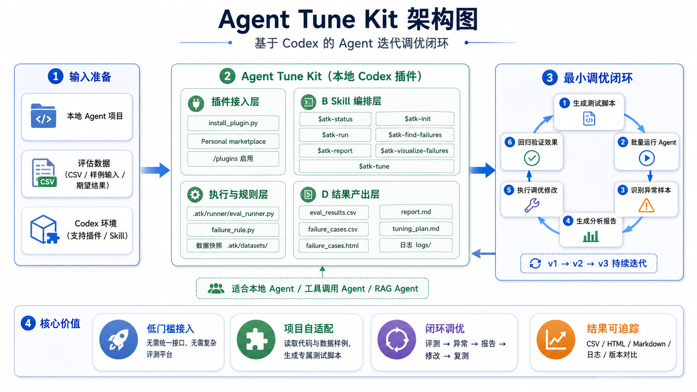

# Agent Tune Kit

简体中文 | [English](README.en.md)

[](https://pypi.org/project/agent-tune-kit/)

Agent Tune Kit 是一个**本地 Codex 插件**，用于评测和调优你自己的本地 Agent。

如果你已经有一个能运行的 Agent，但不知道它在哪些样本上表现不好、原因是什么、下一步该怎么改，Agent Tune Kit 可以帮你把一轮调优闭环跑起来：批量测试、找异常样本、生成报告、让 Codex 调整 Agent，再用下一轮结果验证是否真的变好。

## 架构图



## 适合谁

适合你，如果你有：

- 一个本地 Agent、聊天机器人、工具调用 Agent 或 RAG Agent。
- 一份小型评估数据，推荐 CSV；5 到 20 条样例就能开始。
- 一些可以判断好坏的输入、期望答案或人工可验收结果。
- 想让 Codex 协助定位弱点，并调 prompt、代码、参数或工具配置。

## 使用前准备

你需要：

- Codex。
- 一个 Codex 能读取和修改的本地 Agent 项目。
- 一份评估数据集，建议优先使用 CSV 格式。字段名不必严格固定，Codex 会根据数据内容判断输入和期望结果。

建议在调优前提交一次 git checkpoint，方便对比或回滚你的 Agent 改动。

## 安装

一键运行：

```sh
uvx --from agent-tune-kit atk install
```

如果希望长期保留 `atk` 命令，可以改用：

```sh
uv tool install agent-tune-kit
atk install
```

或使用 `pipx`：

```sh
pipx install agent-tune-kit
atk install
```

安装完成后，在 Codex 中打开插件列表：

```text
/plugins
```

选择并启用 `Agent Tune Kit`。如果刚启用后当前会话里还看不到 `$atk-status` 等自动补全，请重启 Codex，或重新打开当前项目会话。

## 最小调优闭环

下面这些命令都在**你的 Agent 项目**里运行，不是在本仓库里运行。

### 1. 初始化

告诉 Codex 你的 Agent 从哪里启动、评估数据在哪里：

```text
$atk-init 我的 Agent 入口是 scripts/agent.py，评估数据是 data/eval.csv
```

Codex 会生成测试脚本：

```text
.atk/runner/eval_runner.py
```

### 2. 跑评测

```text
$atk-run
```

结果会写入：

```text
.atk/results/v1/eval_results.csv
```

### 3. 找异常样本

让 Codex 判断哪些样本失败：

```text
$atk-find-failures
```

如果你有明确判定规则，可以先生成规则脚本，再按规则筛选：

```text
$atk-init-failure-rule 规则：当 expected 字段与 agent_output 字段不一致时判定为异常
$atk-find-failures-by-rule
```

异常样本会写入：

```text
.atk/results/v1/failure_cases.csv
```

### 4. 生成报告

```text
$atk-report
```

报告会写入：

```text
.atk/results/v1/report.md
```

它会总结测试结果、异常样本、可能原因和建议优先调优的问题。

### 5. 可选：浏览异常样本

```text
$atk-visualize-failures
```

会生成一个本地 HTML：

```text
.atk/results/v1/failure_cases.html
```

适合用来搜索、筛选和人工复核异常样本。

### 6. 让 Codex 调优

```text
$atk-tune
```

Codex 会基于报告修改你的 Agent，并记录本轮调优计划：

```text
.atk/results/v1/tuning_plan.md
```

## 验证是否变好

调优后再跑一轮：

```text
$atk-run
$atk-find-failures
$atk-report
```

新结果会写入 `.atk/results/v2/`。从第二轮开始，报告会对比上一轮 `tuning_plan.md`，说明目标问题是已解决、部分解决、未解决，还是无法判断。

## 你通常需要看的文件

```text
.atk/
├── runner/
│   ├── eval_runner.py
│   └── failure_rule.py
└── results/
    ├── v1/
    │   ├── eval_results.csv
    │   ├── failure_cases.csv
    │   ├── failure_cases.html
    │   ├── report.md
    │   └── tuning_plan.md
    └── v2/
        └── ...
```

日常使用重点看：

- `eval_results.csv`：每条样本的实际输出。
- `failure_cases.csv`：筛选出的异常样本。
- `failure_cases.html`：可选的异常样本浏览页面。
- `report.md`：本轮问题分析和调优建议。
- `tuning_plan.md`：Codex 本轮改了什么、为什么改。

## 常用 Skill

- `$atk-status`：检查当前进度并提示下一步。
- `$atk-init`：生成测试脚本。
- `$atk-run`：运行评测并生成新版本结果。
- `$atk-find-failures`：让 Codex 判断异常样本。
- `$atk-init-failure-rule`：创建或更新异常判定规则。
- `$atk-find-failures-by-rule`：按规则筛选异常样本。
- `$atk-report`：生成分析报告和跨轮验证结论。
- `$atk-visualize-failures`：生成异常样本 HTML 浏览页。
- `$atk-tune`：根据报告调优 Agent。

## 遇到问题时

- 看不到 `$atk-status`：确认已在 `/plugins` 启用插件，然后重启 Codex 或重新打开项目会话。
- 不知道下一步做什么：运行 `$atk-status`。
- 想确认安装状态：运行 `atk status`。
- 想先预览安装影响：运行 `atk preview --smoke`。

贡献者如需本地开发，可 clone 本仓库后运行 `uv sync` 和 `uv run atk install`。
