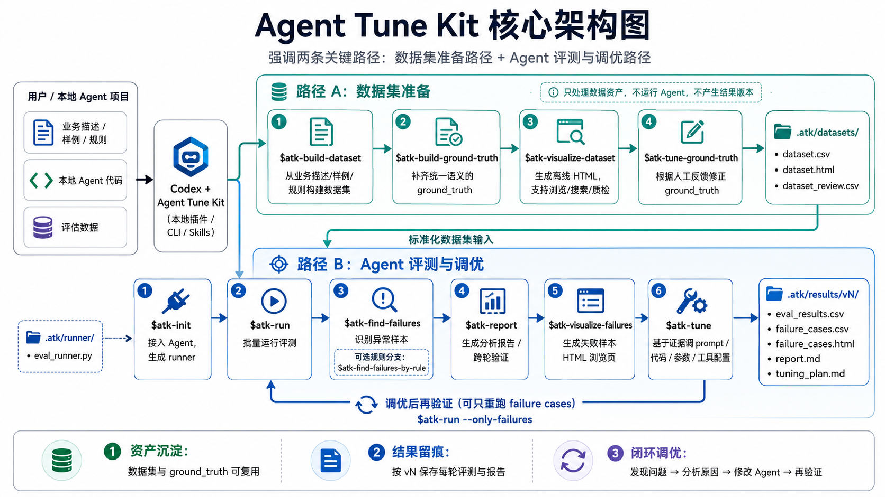

# Agent Tune Kit

简体中文 | [English](README.en.md)

[](https://pypi.org/project/agent-tune-kit/)

Agent Tune Kit 是一个**本地 Codex 插件**，用于把你自己的本地 Agent 从“能跑”推进到“可评测、可诊断、可迭代调优”。

它围绕两件事展开：先把评估数据集整理成可复用、可人工校准的资产；再把 Agent 的批量评测、异常发现、报告分析和调优改动串成一个可重复的闭环。

## 架构图



## 适合谁

适合你，如果你已经有，或准备整理出：

- 一个本地 Agent、聊天机器人、工具调用 Agent 或 RAG Agent。
- 一份小型评估数据，推荐 CSV；5 到 20 条样例就能开始。
- 一些可以判断好坏的输入、期望答案或人工可验收结果。
- 想让 Codex 协助定位弱点，并调 prompt、代码、参数或工具配置。

## 项目价值

Agent Tune Kit 的价值不只是“跑一次测试”，而是把 Agent 调优拆成两条清晰路径：

- **数据集准备路径**：从业务描述、样例或规则生成数据集，补齐 `ground_truth`，用本地 HTML 质检，再根据人工反馈修正预期结果。数据集会沉淀在 `.atk/datasets/`，不绑定某一轮测试结果。
- **Agent 评测与调优路径**：把已有 Agent 接入 runner，批量运行评测，找出异常样本，生成分析报告，浏览失败样本，然后让 Codex 基于证据调优 Agent。每一轮结果写入 `.atk/results/vN/`，方便跨轮验证是否真的变好。

这意味着你可以把 Agent 调优从一次性的主观试错，变成带有样本、结果、报告和调优记录的工程流程。

## 安装

一键运行：

```sh
uvx --from agent-tune-kit atk install
```

如果希望长期保留 `atk` 命令，可以改用：

```sh
uv tool install agent-tune-kit
atk install
```

或使用 `pipx`：

```sh
pipx install agent-tune-kit
atk install
```

安装完成后，在 Codex 中打开插件列表：

```text
/plugins
```

选择并启用 `Agent Tune Kit`。如果刚启用后当前会话里还看不到 `$atk-*` 自动补全，请重启 Codex，或重新打开当前项目会话。

## 两条核心路径

下面这些命令都在**你的 Agent 项目**里运行，不是在本仓库里运行。

理想情况下，你已经有一个 Codex 能读取和修改的本地 Agent 项目，以及一份评估数据集。数据集建议优先使用 CSV；字段名不必严格固定，Codex 会根据内容判断输入、期望结果和评测方式。

### 路径 A：数据集准备

当你还没有可靠评估数据，或已有数据集但预期结果语义不稳定时，先走这条路径：

```text
$atk-build-dataset <你的业务描述、样例或规则>
$atk-build-ground-truth
$atk-visualize-dataset
$atk-tune-ground-truth
```

这条路径只处理 `.atk/datasets/`，不会运行 Agent，也不会创建 `.atk/results/vN`。

| 命令 | 作用 | 关键产物 |
| --- | --- | --- |
| `$atk-build-dataset` | 从业务描述、样例或规则构建小型高价值评估数据集 | `.atk/datasets/dataset.csv` |
| `$atk-build-ground-truth` | 为已有数据集补齐统一语义的 `ground_truth` | 更新 `.atk/datasets/dataset.csv` |
| `$atk-visualize-dataset` | 生成本地离线 HTML，浏览、搜索、筛选、质检数据集，并导出人工反馈 | `.atk/datasets/dataset.html`、浏览器导出的 `dataset_review.csv` |
| `$atk-tune-ground-truth` | 根据 `dataset_review.csv` 修正 `ground_truth` | 更新 `.atk/datasets/dataset.csv` |

`$atk-build-dataset` 会生成包含 `atk_id` 的 `.atk/datasets/dataset.csv`。它不会默认凭空推测规范 `ground_truth`；只有当用户明确提供正确答案或判定标准时才会写入。之后可以用 `$atk-build-ground-truth` 统一补齐预期结果，再用 `$atk-visualize-dataset` 做人工质检。如果 HTML 中导出的 `dataset_review.csv` 指出某些 `ground_truth` 不合理，运行 `$atk-tune-ground-truth` 把反馈写回数据集。

### 路径 B：Agent 评测与调优

当你已经有可运行 Agent 和评估数据集时，走这条调优闭环：

```text
$atk-init 我的 Agent 入口是 scripts/agent.py，评估数据是 data/eval.csv
$atk-run
$atk-find-failures
$atk-report
$atk-visualize-failures
$atk-tune
```

| 命令 | 作用 | 关键产物 |
| --- | --- | --- |
| `$atk-init` | 接入已有 Agent 和评估数据，生成 runner，并把数据集规范化到 ATK 固定位置 | `.atk/runner/eval_runner.py`、`.atk/datasets/dataset.csv` |
| `$atk-run` | 执行批量评测，由 runner 创建或复用当前结果版本 | `.atk/results/vN/eval_results.csv` |
| `$atk-find-failures` | 让 Codex 根据当前评测结果判断异常样本 | `.atk/results/vN/failure_cases.csv` |
| `$atk-report` | 生成当前轮分析报告，并在有上一轮时做跨版本验证 | `.atk/results/vN/report.md` |
| `$atk-visualize-failures` | 生成本地离线 HTML，搜索、筛选、复核失败样本 | `.atk/results/vN/failure_cases.html` |
| `$atk-tune` | 基于报告和失败样本调 prompt、代码、参数或工具配置 | Agent 改动、`.atk/results/vN/tuning_plan.md` |

如果你有稳定、可程序化表达的失败判定标准，可以用规则分支替换 `$atk-find-failures`：

```text
$atk-init-failure-rule 规则：当 expected 字段与 agent_output 字段不一致时判定为异常
$atk-find-failures-by-rule
```

#### 验证是否变好

调优后再跑一轮。常见做法是只重跑上一轮失败样本：

```text
$atk-run --only-failures
$atk-find-failures
$atk-report
```

新结果会写入新的 `.atk/results/vN/`。`--only-failures` 会通过 `atk_id` 将上一轮 `failure_cases.csv` 映射回 `.atk/datasets/dataset.csv`，并只重跑这些行。从第二轮开始，`$atk-report` 会对比上一轮 `tuning_plan.md`，说明目标问题是已解决、部分解决、未解决，还是无法判断。

## 输出结构

```text
.atk/
├── datasets/
│   └── dataset.csv        # ATK 可运行数据集，包含 atk_id
├── runner/
│   ├── eval_runner.py
│   └── failure_rule.py
└── results/
    ├── v1/
    │   ├── eval_results.csv
    │   ├── failure_cases.csv
    │   ├── failure_cases.html
    │   ├── report.md
    │   └── tuning_plan.md
    └── v2/
        └── ...
```

常用输出文件：

- `eval_results.csv`：每条样本的实际输出。
- `failure_cases.csv`：筛选出的异常样本。
- `failure_cases.html`：可选的异常样本浏览页面。
- `report.md`：本轮问题分析和调优建议。
- `tuning_plan.md`：Codex 本轮改了什么、为什么改。

## 常用 Skill

- `$atk-build-dataset`：从业务描述、样例或规则构建 `.atk/datasets/dataset.csv`。
- `$atk-build-ground-truth`：为现有 `.atk/datasets/dataset.csv` 补齐规范的 `ground_truth` 列。
- `$atk-visualize-dataset`：将 `.atk/datasets/dataset.csv` 生成本地 HTML 浏览页，便于快速查看数据并确认 ground_truth 是否符合预期。
- `$atk-tune-ground-truth`：根据 `dataset_review.csv` 中的用户反馈修正 `.atk/datasets/dataset.csv` 里的 `ground_truth`。
- `$atk-init`：生成测试脚本。
- `$atk-run`：运行评测并生成新版本结果。
- `$atk-find-failures`：让 Codex 判断异常样本。
- `$atk-init-failure-rule`：创建或更新异常判定规则。
- `$atk-find-failures-by-rule`：按规则筛选异常样本。
- `$atk-report`：生成分析报告和跨轮验证结论。
- `$atk-visualize-failures`：生成异常样本 HTML 浏览页。
- `$atk-tune`：根据报告调优 Agent。
